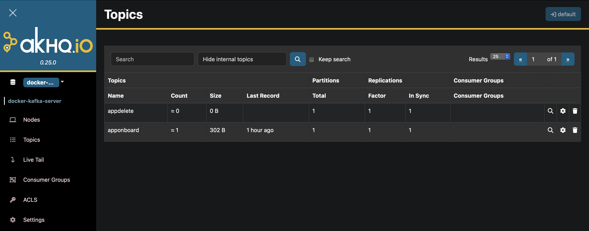

# kafka

On starting the facade service using docker-compose,
you should be able to access the kafka service at http://localhost:8080/

On successful start, you should see `apponboard` and `appdelete` topics already created using 
the akhq dashboard [here](http://localhost:8080/ui/docker-kafka-server/topic)

## How to produce a message

1. Go to http://localhost:8080/ui/docker-kafka-server/topic
2. Click on config/settings icon on the topic (settings wheel icon before the delete icon). Make sure to select the correct topic to produce the message.

   

3. Click `Data` tab and then `+Produce to topic` button on the bottom
4. Set the `Key` and `Value` to fetch and process the data from the data source. It is the name of the app as the key and the description found in the Swagger UI. 

   
   
5. Click `Produce` button to produce the message to the topic.

### apponboard sample payload

```
key: app100

value:
{
    "app_name": "app100",
    "app_description": "Facade unit test app - DO NOT DELETE",
    "api_key": "1ytmOsUYKI2ZGg7WzzSfH3YU87i6UtZ50uMgVCc5",
    "onboarding_status": "Completed",
    "search_enabled": true
}
```

